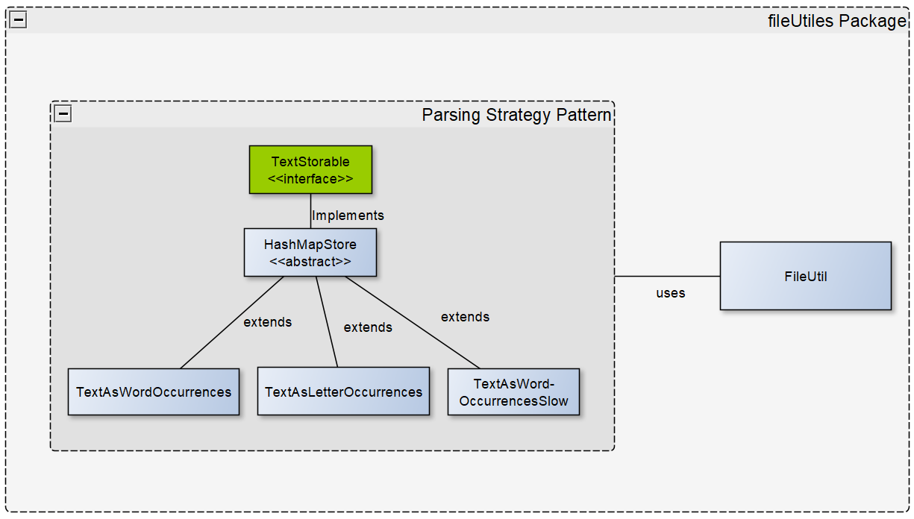
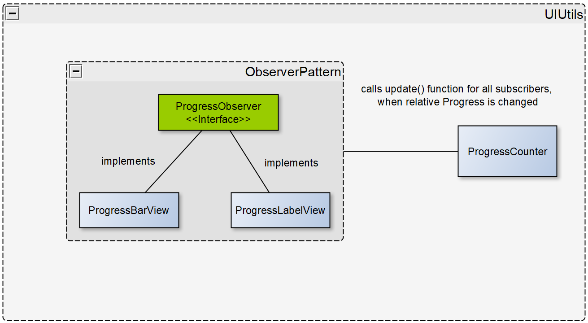

# Text File Analyzer

Simple Application to analyze the occurrences of pre defined Stringpatterns in a textfile. Results are displayed to a simple GUI.

## Dependencies

| Name      | Version  |   
| :-------- | :------- | 
| `javafx`  | `16`     |
| `java`    | `15`     |

  
## Control flow of the app

  
## System Design
To make the file parser logic modular, I used the strategy patteren. 
The utility class `FileUtil` is responsible for calling the function `addLine()` of the TextStorable object for each newly read line.
This makes it easy to develop different parsing strategies.
As a demonstration, I have expanded the program so that the occurrences of each letter can also be displayed.

To show the progress I used the observer pattern. 
The individual UI elements that should react to a change in progress subscribe to the `ProgressCounter`. 
The `ProgressCounter` calls the update function of all subscribed objects every time the progress changes.

## Added Features

- Drag and drop functionality to detect file paths -> just drop the file in the text field
- You can chose between diffrent parsing strategies
    - TextAsWordOccurrencesSlow is for testing purposes -> after each processed line the analyzing thread sleeps for 300 ms

  