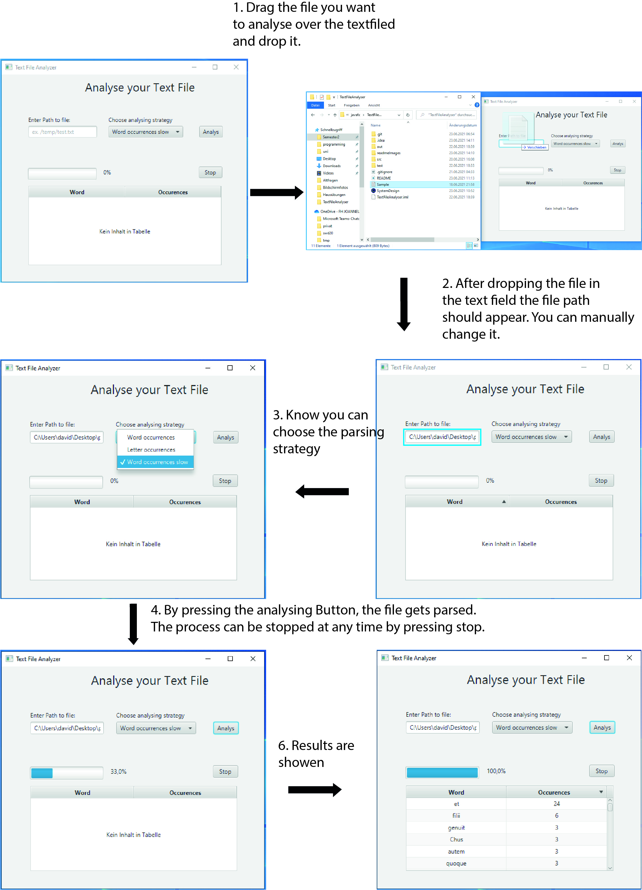

# Text File Analyzer

Simple Application to analyze the occurrences of pre defined Stringpatterns in a textfile. Results are displayed to a simple GUI.

## Dependencies

| Name      | Version  |   
| :-------- | :------- | 
| `javafx`  | `16`     |
| `java`    | `15`     |

  
## Control flow of the app

  
## System Design

## Added Features

- Drag and drop functionality to detect file paths -> just drop the file in the textfield
- You can chose between diffrent parsing strategies
    - TextAsWordOccurrencesSlow is for testing purposes -> after each processed line the analyzing thread sleeps for 300 ms

  